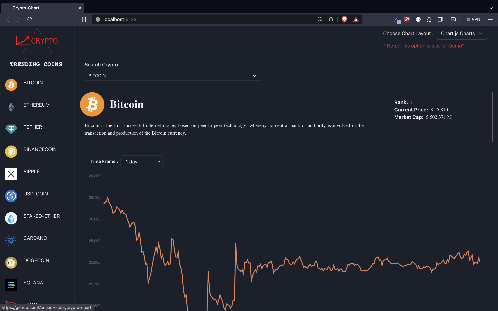

# Crypto Charting App



## Overview

The Crypto Charting App is a web application that allows users to track cryptocurrency prices and view historical price charts. It utilizes the CoinGecko API for cryptocurrency data and supports two charting libraries: Chart.js and Apache ECharts. The application is built using React.js and styled with Chakra UI.

## Features

- **Cryptocurrency Information**: View detailed information about a selected cryptocurrency, including its name, description, rank, current price, and market cap.
- **Historical Price Charts**: Visualize historical price trends for cryptocurrencies over various time frames (e.g., 1 day, 1 week, 1 month, etc.).
- **Charting Libraries**: Choose between two charting libraries: Chart.js and Apache ECharts to customize your charting experience.
- **Currency Conversion**: Easily switch between different fiat currencies (e.g., USD, INR) to view prices in your preferred currency.
- **Trending Coins**: Explore a list of trending cryptocurrencies to stay up to date with the latest market trends.

## Tech Stack

- **React.js**: The project is built using React.js, a popular JavaScript library for building user interfaces.
- **Chakra UI**: Chakra UI is used for styling and provides a clean and responsive design for the application.
- **Chart.js**: Chart.js is used for creating interactive and customizable charts to display historical cryptocurrency prices.
- **Apache ECharts**: Apache ECharts is an alternative charting library for creating dynamic and visually appealing charts.
- **CoinGecko API**: The CoinGecko API is used to fetch real-time cryptocurrency data, including prices, market cap, and descriptions.

## Getting Started

To get started with the Crypto Charting App, follow these steps:

1. Clone the repository to your local machine:

   ```bash
   git clone https://github.com/AmaanHaider/crypto-chart.git

2. Navigate to the project directory:

   cd crypto-chart


3. Install the project dependencies:

   npm install

4. Navigate to the project directory:

   cd crypto-charting-app

5. Start the development server:

   npm run dev

6. Open your web browser and go to http://localhost:5173 to access the application.


## Usage

Select a cryptocurrency from the dropdown menu to view its detailed information and historical price chart.
Choose a time frame (e.g., 1 day, 1 week) to adjust the historical price data on the chart.
Use the currency selector to switch between different fiat currencies for price conversion.
Explore trending coins to stay informed about the latest market trends.

## Acknowledgments

Special thanks to the CoinGecko API for providing real-time cryptocurrency data.
Chart.js and Apache ECharts for their powerful charting capabilities.
Chakra UI for making UI development a breeze.

Feel free to contribute to this project by submitting issues or pull requests.

Happy charting!


